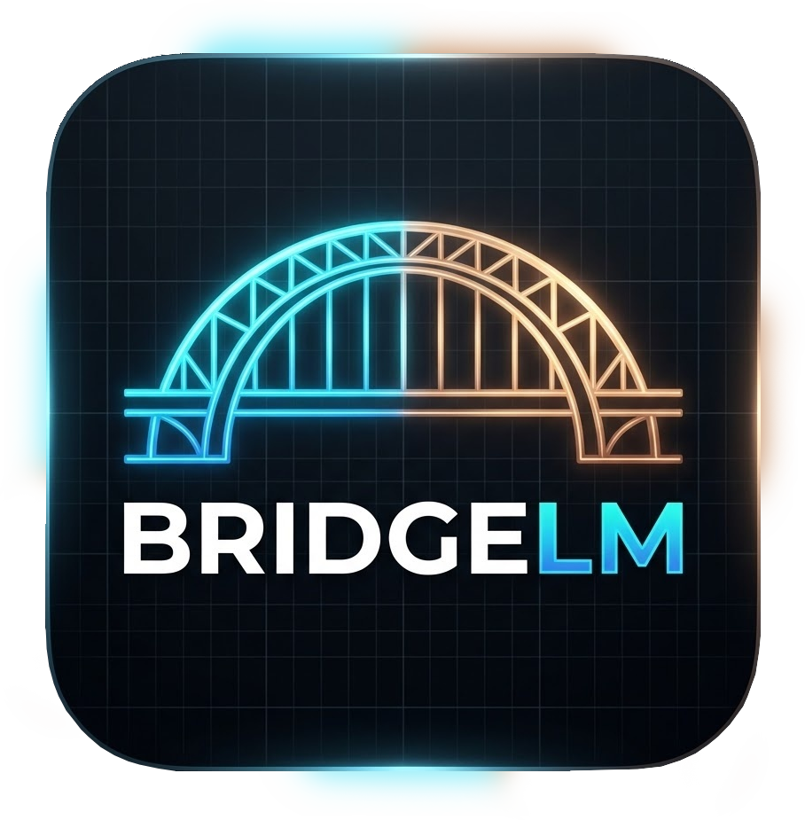

<p align="center">
  
</p>

# BridgeLM

**Turn 11 free AI web platforms into a local OpenAI-compatible API — zero API costs, fully automatic.**


BridgeLM is a desktop application that automatically captures browser session cookies from free AI web platforms and serves them as a local **OpenAI-compatible API** (`/v1/chat/completions`). One click to connect — Chrome opens, you login, cookies are captured automatically. Use the API in any app like Open WebUI, Continue, LangChain, or curl.

---

## Table of Contents

- [Introduction](#introduction)
- [Supported Providers](#supported-providers)
- [How It Works](#how-it-works)
- [Features](#features)
- [Requirements](#requirements)
- [Tech Stack](#tech-stack)
- [Installation](#installation)
- [Usage](#usage)
- [API Reference](#api-reference)
- [Project Structure](#project-structure)
- [Things Done](#things-done)
- [Limitations](#limitations)
- [Credits](#credits)
- [License](#license)

---

## Introduction

Most AI platforms offer free access through their web interfaces (chat.deepseek.com, claude.ai, chatgpt.com, etc.), but charge for API access. **BridgeLM** bridges this gap by:

1. **Automatically capturing** your browser session (cookies + bearer tokens) when you login to these platforms
2. **Wrapping** each platform's internal web API into a standard OpenAI-compatible format
3. **Serving** a local API server that any application can use — as if you had a paid API key

The result: you get a free, local API endpoint at `http://127.0.0.1:3456/v1/chat/completions` that works with 12 different AI providers, supporting 30+ models including GPT-4o, Claude Opus, DeepSeek R1, Gemini 2.5 Pro, and more.

---

## Supported Providers

| # | Provider | Icon | Models | Platform |
|---|----------|------|--------|----------|
| 1 | **DeepSeek** | 🐋 | `deepseek-chat` (64k), `deepseek-reasoner` (64k, reasoning) | chat.deepseek.com |
| 2 | **Claude** | 🟠 | `claude-sonnet-4-6` (195k), `claude-opus-4-6` (195k, reasoning), `claude-haiku-4-6` (195k) | claude.ai |
| 3 | **ChatGPT** | ⚫ | `gpt-4o` (128k), `gpt-4-turbo` (128k), `gpt-4o-mini` (128k) | chatgpt.com |
| 4 | **Gemini** | ✴️ | `gemini-2.5-pro` (1M), `gemini-2.0-flash` (1M), `gemini-2.0-pro` (1M) | gemini.google.com |
| 5 | **Grok** | ⬛ | `grok-3` (128k), `grok-3-mini` (128k) | grok.com |
| 6 | **Kimi** | 🌙 | `kimi-latest` (128k), `moonshot-v1-8k`, `moonshot-v1-32k`, `moonshot-v1-128k` | kimi.moonshot.cn |
| 7 | **Qwen International** | ✨ | `qwen3.5-plus` (131k), `qwen3.5-turbo` (131k), `qwen-max` (32k), `qwen-plus` (131k) | chat.qwen.ai |
| 8 | **Qwen China** | ✨ | `qwen3.5-plus` (131k), `qwen3.5-turbo` (131k) | qianwen.com |
| 9 | **GLM (智谱清言)** | 🧠 | `glm-4-plus` (128k), `glm-4-think` (128k, reasoning) | chatglm.cn |
| 10 | **GLM International** | 🧠 | `glm-4-plus` (128k), `glm-4-think` (128k, reasoning) | chat.z.ai |
| 11 | **Doubao** | 🤖 | `doubao-seed-2.0` (128k), `doubao-pro-256k` (256k) | doubao.com |

**Total: 11 providers, 30+ models, all free through browser sessions.**

---

## How It Works

```
Your Application (Open WebUI, Continue, LangChain, curl...)
        │
        │  POST http://127.0.0.1:3456/v1/chat/completions
        │  { "model": "deepseek/deepseek-chat", "messages": [...] }
        ▼
┌──────────────────────────────────────────────────────┐
│  BridgeLM (Electron Desktop App)              │
│  ┌────────────────────────────────────────────────┐  │
│  │  Express Server (OpenAI-compatible API)        │  │
│  │  • GET  /v1/models                             │  │
│  │  • POST /v1/chat/completions (streaming)       │  │
│  │  • GET  /health                                │  │
│  └────────────────────────────────────────────────┘  │
│  ┌────────────────────────────────────────────────┐  │
│  │  Provider Manager (routes by model name)       │  │
│  └────────────────────────────────────────────────┘  │
│  ┌────────────────────────────────────────────────┐  │
│  │  12 Provider Modules (auth + client + stream)  │  │
│  │  Uses captured cookies/bearer tokens           │  │
│  └────────────────────────────────────────────────┘  │
│  ┌────────────────────────────────────────────────┐  │
│  │  Auto-Login Engine (Playwright + Chrome CDP)   │  │
│  │  • Launches Chrome                             │  │
│  │  • Intercepts network requests                 │  │
│  │  • Captures cookies + bearer tokens            │  │
│  └────────────────────────────────────────────────┘  │
└──────────────────────────────────────────────────────┘
        │
        ▼
AI Platform Web APIs (DeepSeek, Claude, ChatGPT, Gemini...)
```

### The 3-Step Automatic Flow

1. **Click "Connect (Auto)"** on any provider card
2. **Chrome opens automatically** → navigate to the platform → login with your account
3. **Session captured** → cookies and bearer tokens are intercepted from network requests → saved to local config

No manual cookie copying. No DevTools. No API keys. Fully automatic.

---

## Features

- **Fully Automatic Authentication** — One-click login via Playwright CDP browser automation. No manual cookie extraction.
- **Auto-Update Cookies** — Sessions stay alive forever. Cookies auto-refresh every 10 minutes. No re-auth needed.
- **11 AI Providers** — DeepSeek, Claude, ChatGPT, Gemini, Grok, Kimi, Qwen, GLM, Doubao, and more.
- **30+ Models** — Access GPT-4o, Claude Opus/Sonnet, DeepSeek R1, Gemini 2.5 Pro, all for free.
- **OpenAI-Compatible API** — Standard `/v1/chat/completions` endpoint. Drop-in replacement for OpenAI API.
- **Streaming Support** — SSE streaming for real-time token-by-token responses.
- **Shared Browser** — One Chrome instance shared across providers. Login once, use everywhere.
- **Auto-Reconnect** — If Chrome is closed, automatically re-launches on next connect.
- **Dark Theme UI** — Beautiful Material UI dark interface with gradient branding.
- **Portable API Key** — Auto-generated API key for securing your local gateway.
- **Persistent Config** — Provider credentials saved to local JSON config. Survives app restarts.
- **Health Monitoring** — Real-time provider status via `/health` endpoint.
- **Cross-Platform** — Works on macOS, Windows, and Linux.

---

## Requirements

### System Requirements

| Requirement | Version | Notes |
|-------------|---------|-------|
| **Node.js** | >= 22 | Required for ESM + Playwright |
| **npm** | >= 10 | Comes with Node.js |
| **Chrome/Chromium** | Any recent | Must be installed on system |
| **OS** | macOS / Windows / Linux | Chrome auto-detection per platform |

### Account Requirements

You need a **free account** on each AI platform you want to use:
- DeepSeek — free at chat.deepseek.com
- Claude — free at claude.ai (limited daily messages)
- ChatGPT — free at chatgpt.com (GPT-4o-mini free tier)
- Gemini — free at gemini.google.com
- Grok — free at grok.com (X account required)
- Kimi — free at kimi.moonshot.cn
- Qwen — free at chat.qwen.ai
- GLM — free at chatglm.cn
- Doubao — free at doubao.com

---

## Tech Stack

| Layer | Technology | Purpose |
|-------|-----------|---------|
| **Desktop Shell** | Electron 35 | Cross-platform desktop app |
| **Language** | TypeScript 5.8 | Type-safe development |
| **Frontend** | React 19 | UI framework |
| **UI Library** | Material UI (MUI) 6 | Component library with dark theme |
| **Routing** | React Router 7 | Client-side navigation |
| **Bundler** | esbuild | Fast TypeScript compilation |
| **Frontend Dev** | Vite 6 | HMR dev server for renderer |
| **API Server** | Express 5 | OpenAI-compatible REST API |
| **Browser Automation** | Playwright Core | Chrome CDP connection for auto-login |
| **Browser Launcher** | Chrome DevTools Protocol | Launching Chrome with `--remote-debugging-port` |
| **Config Storage** | JSON file | Persistent credential storage |

---

## Installation

### 1. Clone the Repository

```bash
git clone https://github.com/ShahrukhYousafzai/BridgeLM.git
cd BridgeLM
```

### 2. Install Dependencies

```bash
npm install
```

> **Note:** If `npm install` times out due to slow network (Electron binary is ~100MB), you can skip the Electron binary download:
> ```bash
> ELECTRON_SKIP_BINARY_DOWNLOAD=1 npm install --prefer-offline
> npm install electron --prefer-offline
> ```

### 3. Start in Development Mode

```bash
# Start the Vite renderer dev server
npx vite dev --config renderer/vite.config.ts &

# Build the main process
npx esbuild src/main/index.ts \
  --outfile=dist/main/index.js \
  --platform=node \
  --format=esm \
  --bundle \
  --external:electron \
  --external:playwright-core \
  --external:better-sqlite3 \
  --external:express

# Also build the preload script
npx esbuild src/main/preload.ts \
  --outfile=dist/main/preload.js \
  --platform=node \
  --format=cjs \
  --bundle \
  --external:electron

# Launch Electron
NODE_ENV=development npx electron dist/main/index.js
```

### 4. Build for Production

```bash
# Build main process
npx esbuild src/main/index.ts --outfile=dist/main/index.js --platform=node --format=esm --bundle --external:electron --external:playwright-core --external:better-sqlite3 --external:express
npx esbuild src/main/preload.ts --outfile=dist/main/preload.js --platform=node --format=cjs --bundle --external:electron

# Build renderer
npx vite build --config renderer/vite.config.ts

# Package Electron app
npx electron-builder --dir
```

---

## Usage

### Step 1: Launch the App

Open the Electron app. You'll see 12 provider cards with "Connect (Auto)" buttons.

### Step 2: Connect a Provider

Click **"Connect (Auto)"** on any provider (e.g., DeepSeek):
- Chrome opens automatically to the platform's login page
- Login with your free account
- The app detects your session and captures cookies + bearer tokens
- Card changes to **"Connected"** status

### Step 3: Use the API

The gateway runs at `http://127.0.0.1:3456`. Use it from any application:

#### cURL

```bash
# List available models
curl http://127.0.0.1:3456/v1/models

# Non-streaming chat completion
curl http://127.0.0.1:3456/v1/chat/completions \
  -H "Content-Type: application/json" \
  -d '{
    "model": "deepseek/deepseek-chat",
    "messages": [{"role": "user", "content": "Hello!"}],
    "stream": false
  }'

# Streaming chat completion
curl http://127.0.0.1:3456/v1/chat/completions \
  -H "Content-Type: application/json" \
  -d '{
    "model": "claude/claude-sonnet-4-6",
    "messages": [{"role": "user", "content": "Write a poem"}],
    "stream": true
  }'
```

#### Python (OpenAI SDK)

```python
from openai import OpenAI

client = OpenAI(
    base_url="http://127.0.0.1:3456/v1",
    api_key="fg-your-api-key"
)

response = client.chat.completions.create(
    model="deepseek/deepseek-chat",
    messages=[{"role": "user", "content": "Hello!"}]
)
print(response.choices[0].message.content)
```

#### JavaScript (OpenAI SDK)

```javascript
import OpenAI from 'openai';

const client = new OpenAI({
  baseURL: 'http://127.0.0.1:3456/v1',
  apiKey: 'fg-your-api-key',
});

const response = await client.chat.completions.create({
  model: 'gemini/gemini-2.0-flash',
  messages: [{ role: 'user', content: 'Hello!' }],
});
console.log(response.choices[0].message.content);
```

#### Model Format

Models are specified as `provider/model-id`:
- `deepseek/deepseek-chat`
- `deepseek/deepseek-reasoner`
- `claude/claude-sonnet-4-6`
- `claude/claude-opus-4-6`
- `chatgpt/gpt-4o`
- `gemini/gemini-2.5-pro`
- `grok/grok-3`
- `kimi/kimi-latest`
- `qwen/qwen3.5-plus`
- `glm/glm-4-plus`
- `doubao/doubao-seed-2.0`
- `manus/manus-1.6`

---

## API Reference

| Method | Endpoint | Description |
|--------|----------|-------------|
| `GET` | `/v1/models` | List all connected models in OpenAI format |
| `POST` | `/v1/chat/completions` | Chat completion (supports `stream: true/false`) |
| `GET` | `/health` | Health check with per-provider status |

### Request Format

```json
{
  "model": "deepseek/deepseek-chat",
  "messages": [
    {"role": "system", "content": "You are a helpful assistant."},
    {"role": "user", "content": "Hello!"}
  ],
  "stream": false,
  "temperature": 0.7,
  "max_tokens": 4096
}
```

### Response Format (Non-streaming)

```json
{
  "id": "chatcmpl-abc123",
  "object": "chat.completion",
  "created": 1710000000,
  "model": "deepseek/deepseek-chat",
  "choices": [{
    "index": 0,
    "message": {
      "role": "assistant",
      "content": "Hello! How can I help you today?"
    },
    "finish_reason": "stop"
  }],
  "usage": {
    "prompt_tokens": 10,
    "completion_tokens": 15,
    "total_tokens": 25
  }
}
```

### Streaming Response Format

```
data: {"id":"chatcmpl-abc123","object":"chat.completion.chunk","created":1710000000,"model":"deepseek/deepseek-chat","choices":[{"index":0,"delta":{"content":"Hello"},"finish_reason":null}]}

data: {"id":"chatcmpl-abc123","object":"chat.completion.chunk","created":1710000000,"model":"deepseek/deepseek-chat","choices":[{"index":0,"delta":{"content":"!"},"finish_reason":null}]}

data: [DONE]
```

---

## Project Structure

```
BridgeLM/
├── src/
│   ├── main/                          # Electron main process
│   │   ├── index.ts                   # App entry, IPC handlers, gateway startup
│   │   └── preload.ts                 # Preload script (exposes window.api)
│   ├── gateway/
│   │   ├── server.ts                  # Express server (OpenAI-compatible API)
│   │   ├── types.ts                   # TypeScript types for API requests/responses
│   │   └── provider-manager.ts        # Provider registry, routing, model listing
│   ├── providers/
│   │   ├── common.ts                  # Shared helpers (response builders, SSE parser)
│   │   ├── deepseek/                  # DeepSeek: PoW challenge + web API
│   │   │   ├── auth.ts                # Auto-login: cookie capture + validation
│   │   │   ├── client.ts              # API client: chat + streaming
│   │   │   └── index.ts               # AIProvider implementation
│   │   ├── claude/                    # Claude: sessionKey + GraphQL API
│   │   ├── chatgpt/                   # ChatGPT: session token + backend API
│   │   ├── gemini/                    # Gemini: Google cookies + Bard RPC
│   │   ├── grok/                      # Grok: x.com cookies + REST API
│   │   ├── kimi/                      # Kimi: Moonshot cookies + API
│   │   ├── qwen/                      # Qwen International: cookie-based
│   │   ├── qwen-cn/                   # Qwen China: cookie-based
│   │   ├── glm/                       # GLM (智谱清言): cookie + bearer
│   │   ├── glm-intl/                  # GLM International: cookie + bearer
│   │   ├── doubao/                    # Doubao: ByteDance cookie API
│   ├── browser/
│   │   ├── auto-login.ts              # Playwright CDP auto-capture engine
│   │   └── chrome.ts                  # Chrome launcher, port detection
│   └── config/
│       └── store.ts                   # JSON config persistence
├── renderer/
│   ├── index.html                     # Entry HTML
│   ├── vite.config.ts                 # Vite dev server config
│   ├── tsconfig.json                  # Renderer TypeScript config
│   └── src/
│       ├── main.tsx                   # React entry + fallback API
│       ├── App.tsx                    # Main app (tabs, header, snackbar)
│       ├── types.d.ts                 # Window.api type declarations
│       ├── components/
│       │   ├── Dashboard.tsx          # 12 provider cards + Connect buttons
│       │   └── ApiSettings.tsx        # Port, API key, cURL examples
│       ├── hooks/                     # (reserved for future hooks)
│       └── theme/
│           └── theme.ts               # MUI dark theme config
├── package.json                       # Dependencies & scripts
├── tsconfig.json                      # Root TypeScript config
└── README.md                          # This file
```

---

## Things Done

- [x] Electron desktop app with React + TypeScript
- [x] Material UI dark theme with gradient branding
- [x] OpenAI-compatible API gateway (`/v1/chat/completions`)
- [x] SSE streaming support
- [x] Playwright CDP automatic cookie capture
- [x] Shared Chrome browser across providers
- [x] Auto-reconnect when browser is closed
- [x] Universal login detection (20+ session cookie patterns)
- [x] Bearer token interception from network requests
- [x] 11 AI providers fully implemented:
  - [x] DeepSeek (with PoW SHA-256 challenge)
  - [x] Claude (sessionKey capture)
  - [x] ChatGPT (session token extraction)
  - [x] Gemini (Google auth cookies)
  - [x] Grok (x.com cookies)
  - [x] Kimi (Moonshot bearer)
  - [x] Qwen International
  - [x] Qwen China
  - [x] GLM (智谱清言)
  - [x] GLM International
  - [x] Doubao (ByteDance)
- [x] Persistent credential storage
- [x] Auto-generated API key
- [x] Auto-Update Cookies — sessions refresh every 10 min, stay alive forever
- [x] Animated neon border beam (Cyan + Copper spinning glow)
- [x] Health monitoring endpoint
- [x] Provider status cards with model lists
- [x] Copy-to-clipboard for API key and cURL examples
- [x] Cross-platform Chrome detection (macOS, Windows, Linux)

---

## Limitations

| Limitation | Details |
|------------|---------|
| **Free tier limits** | AI platforms may impose daily message limits on free accounts (e.g., Claude free tier has ~40 messages/day) |
| **Rate limiting** | Platforms may rate-limit requests. No built-in rate limiting in the gateway |
| **PoW challenges** | DeepSeek requires a SHA-256 proof-of-work challenge. Only SHA-256 is supported (DeepSeekHashV1 WASM is not) |
| **Tool calling** | Supported by some providers (DeepSeek, Claude). May not work on all platforms |
| **No image uploads** | Multi-modal image inputs are not yet implemented |
| **No conversation memory** | Each request is independent. No conversation state is maintained by the gateway |
| **Chrome required** | Requires Chrome/Chromium to be installed on the system |
| **Single instance** | Only one Chrome instance at a time. Can't use multiple profiles simultaneously |

---

## Credits

- **[OpenClaw Zero Token](https://github.com/linuxhsj/openclaw-zero-token)** — Provider implementations and auto-login patterns based on this project
- **[Gemini-FastAPI](https://github.com/Nativu5/Gemini-FastAPI)** — Architecture inspiration for wrapping web platforms into APIs
- **[Playwright](https://playwright.dev/)** — Browser automation engine
- **[Electron](https://www.electronjs.org/)** — Desktop application framework
- **[Material UI](https://mui.com/)** — React component library

---

## License

MIT

---

## Created by

**Shahrukh Yousafzai** with ❤️
